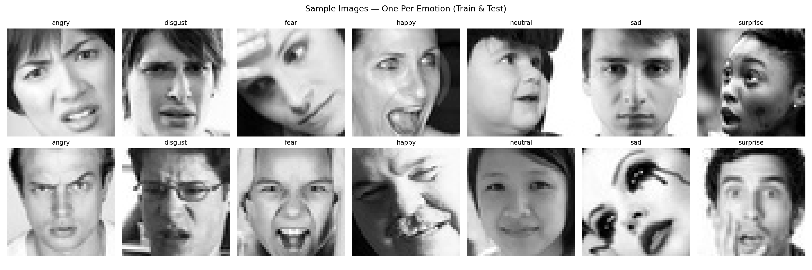
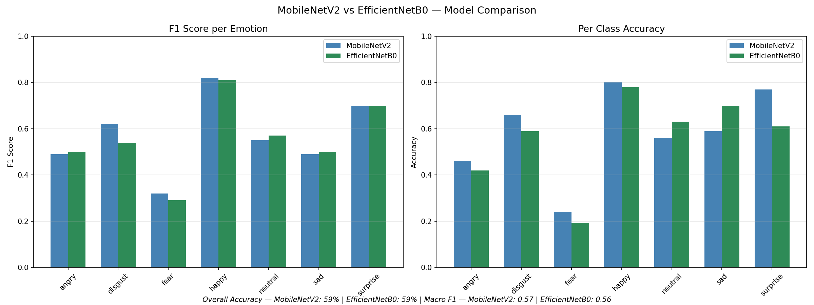
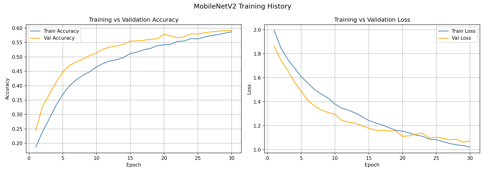
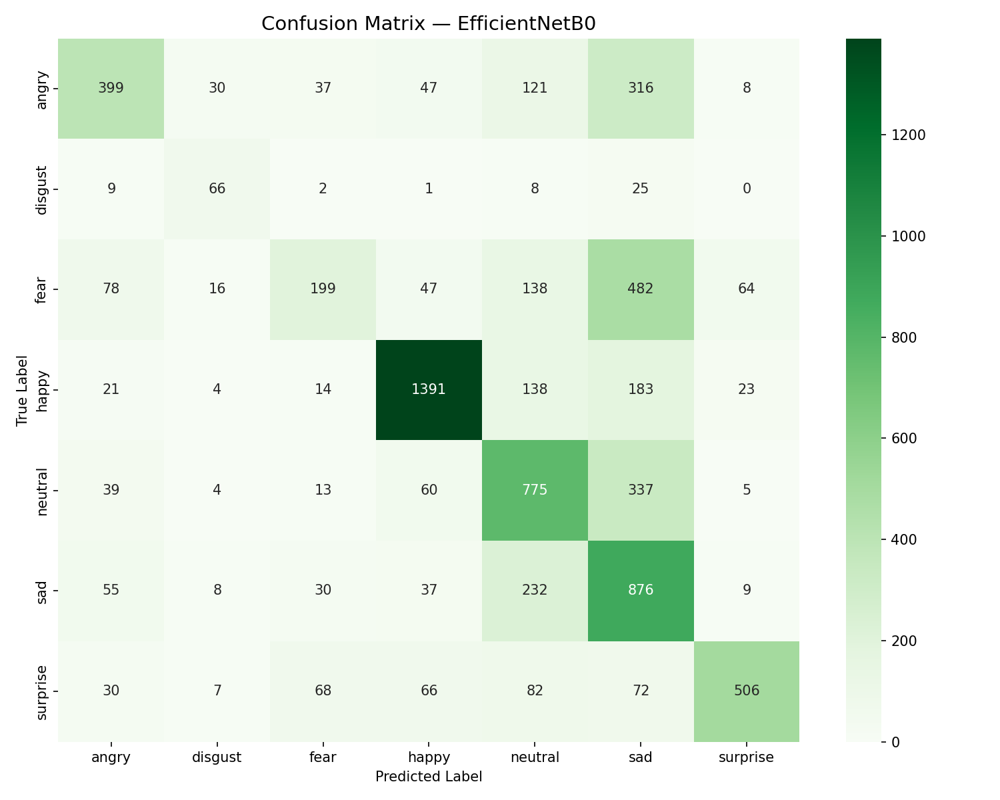
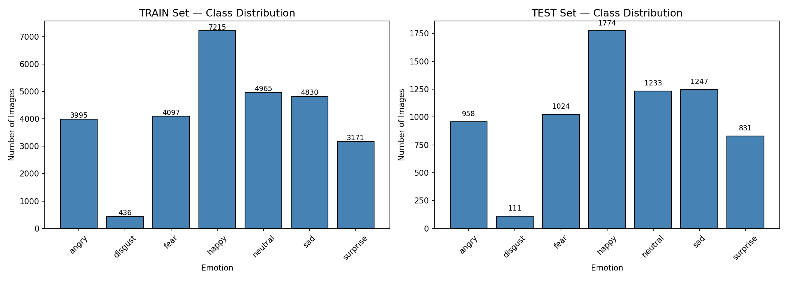
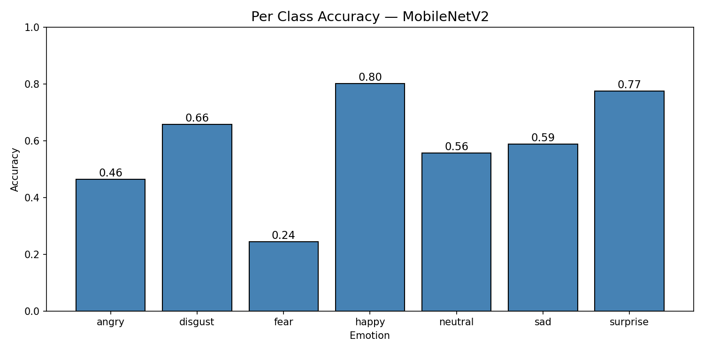

# Facial Emotion Recognition with EfficientNetB0 & Grad-CAM++

A deep learning system that classifies facial expressions into 7 emotion categories using transfer learning on the FER2013 dataset. Both EfficientNetB0 and MobileNetV2 are trained and compared, with Grad-CAM++ visualizations showing how attention evolves across training checkpoints. Deployed as an interactive Gradio web app supporting image upload and live webcam input.



---

## Demo

**Live App:** [Try it on Hugging Face Spaces](https://huggingface.co/spaces/TejaThiriveedhi/facial-emotion-recognition)

This deployment demonstrates the full path from a trained Keras model to a served, interactive application — checkpoint loading, Grad-CAM++ inference, and a Gradio interface running live on Hugging Face Spaces infrastructure.

Upload a face image or use your webcam — the app predicts the emotion, displays a confidence score for all 7 classes, and overlays a Grad-CAM++ heatmap showing which facial regions drove the prediction.


---

## Features

- **7-class emotion classification** — Angry, Disgust, Fear, Happy, Neutral, Sad, Surprise
- **Two model comparison** — EfficientNetB0 vs MobileNetV2, both fine-tuned with transfer learning
- **Grad-CAM++ explainability** — epoch-wise heatmaps at checkpoints 5, 15, and 30
- **Interactive Gradio app** — image upload + live webcam, confidence bar chart, attention overlay
- **Trained on Kaggle** — dual NVIDIA Tesla T4 GPUs using TensorFlow's MirroredStrategy

---

## Model Architecture

### EfficientNetB0
| Layer | Output Shape | Parameters |
|---|---|---|
| EfficientNetB0 Base (last 50 layers fine-tuned) | 7×7×1280 | 4,049,571 |
| GlobalAveragePooling2D | 1280 | 0 |
| BatchNormalization | 1280 | 5,120 |
| Dense (256, ReLU) | 256 | 327,936 |
| Dropout (0.4) | 256 | 0 |
| Dense (128, ReLU) | 128 | 32,896 |
| Dropout (0.3) | 128 | 0 |
| Dense (7, Softmax) | 7 | 903 |
| **Total Trainable** | | **~1.5M** |

### MobileNetV2
| Layer | Output Shape | Parameters |
|---|---|---|
| MobileNetV2 Base (last 50 layers fine-tuned) | 7×7×1280 | 2,257,984 |
| GlobalAveragePooling2D | 1280 | 0 |
| Dense (256, ReLU) | 256 | 327,936 |
| Dropout (0.4) | 256 | 0 |
| Dense (128, ReLU) | 128 | 32,896 |
| Dropout (0.3) | 128 | 0 |
| Dense (7, Softmax) | 7 | 903 |
| **Total Trainable** | | **~1.2M** |

---

## Training Configuration

| Parameter | EfficientNetB0 | MobileNetV2 |
|---|---|---|
| Input Size | 224×224×3 | 224×224×3 |
| Pretrained Weights | ImageNet | ImageNet |
| Fine-tuned Layers | Last 50 | Last 50 |
| Optimizer | Adam | Adam |
| Learning Rate | 1×10⁻⁴ | 1×10⁻⁵ |
| Batch Size | 64 | 64 |
| Epochs | 30 | 30 |
| Early Stopping Patience | 7 | 7 |
| Class Weighting | Yes | Yes |
| Training Platform | Kaggle (2× NVIDIA Tesla T4) | Kaggle (2× NVIDIA Tesla T4) |

---

## Results

| Metric | EfficientNetB0 | MobileNetV2 |
|---|---|---|
| Peak Validation Accuracy | **60.1%** | 59.6% |
| Final Training Accuracy | 65.1% | 58.4% |
| Final Validation Loss | 1.083 | 1.093 |
| Macro F1-Score | 0.56 | **0.57** |
| Model Size | 39.5 MB | 27.4 MB |
| Generalization Gap | ~5.0% | **~1.2%** |







### Per-Class Performance

| Emotion | Eff F1 | Eff Acc | Mob F1 | Mob Acc |
|---|---|---|---|---|
| Angry | 0.50 | 42% | 0.49 | 46% |
| Disgust | 0.54 | 59% | 0.62 | 66% |
| Fear | 0.29 | 19% | 0.32 | 24% |
| Happy | 0.81 | 78% | 0.82 | 80% |
| Neutral | 0.57 | 63% | 0.55 | 56% |
| Sad | 0.50 | 70% | 0.49 | 59% |
| Surprise | 0.70 | 61% | 0.70 | 77% |

### Grad-CAM++ Attention Evolution (Both Models)

Side-by-side comparison of how attention maps evolve across training checkpoints (epochs 5, 15, 30) for all 7 emotion classes.


---

## Project Structure

---
facial-emotion-recognition/
│
├── FER2013_Emotion_Detection.ipynb     # Full training pipeline
├── FER2013_Gradio_App.ipynb            # Gradio app notebook
├── gradio_app.py                       # Standalone Gradio app
├── requirements.txt
├── README.md
├── .gitignore
│
├── checkpoints/
│   ├── efficientnet/
│   │   ├── eff_epoch_5.weights.h5
│   │   ├── eff_epoch_15.weights.h5
│   │   ├── eff_epoch_30.weights.h5
│   │   └── eff_epoch_final.weights.h5
│   │
│   └── mobilenet/
│       ├── mob_epoch_5.weights.h5
│       ├── mob_epoch_15.weights.h5
│       ├── mob_epoch_30.weights.h5
│       └── mob_epoch_final.weights.h5
│
├── models/
│   ├── efficientnetb0.weights.h5
│   ├── fer.weights.h5
│   └── mobilenetv2_fer_finetuned.h5
│
├── saved_models/
│   ├── efficientnet_full.keras         # Full saved model
│   └── mobilenet_full.keras            # Full saved model
│
├── logs/
│   ├── efficientnet_log.csv
│   ├── efficientnet_training_log.csv
│   ├── mobilenet_log.csv
│   └── training_log.csv
│
└── (visualizations at root level)
    ├── sample_images.png
    ├── gradcam_pp_efficientnet.png
    ├── gradcam_pp_combined.png         # Side-by-side both models across checkpoints
    ├── confusion_matrix_eff.png
    ├── training_curves.png
    ├── class_distribution.png
    ├── per_class_accuracy.png
    └── model_comparison.png
---

## Getting Started

### 1. Clone the repository

```bash
git clone https://github.com/TejaThiriveedhi/facial-emotion-recognition.git
cd facial-emotion-recognition
```

### 2. Create a virtual environment and install dependencies

```bash
python -m venv venv
source venv/bin/activate        # On Windows: venv\Scripts\activate
pip install -r requirements.txt
```

### 3. Run the Gradio app

```bash
python gradio_app.py
```

Open the local URL shown in the terminal. Upload a face image or use your webcam to get a real-time emotion prediction with Grad-CAM++ overlay and confidence scores.

---

## Training

Open `FER2013_Emotion_Detection.ipynb` in Google Colab or Kaggle. The notebook covers:

- FER2013 dataset loading and preprocessing (grayscale → RGB, resized to 224×224)
- Class imbalance handling with balanced class weights
- EfficientNetB0 and MobileNetV2 transfer learning and fine-tuning
- Checkpoint saving at epochs 5, 15, and 30
- Evaluation: confusion matrix, per-class F1, training curves
- Grad-CAM++ visualization across training checkpoints

---

## Tech Stack

| Component | Tool |
|---|---|
| Deep learning framework | TensorFlow 2.19.0 / Keras |
| Model backbones | EfficientNetB0, MobileNetV2 |
| Explainability | Grad-CAM++ |
| App framework | Gradio |
| Dataset | FER2013 (35,887 images, 7 classes) |
| Training platform | Kaggle (2× NVIDIA Tesla T4, MirroredStrategy) |
| Language | Python 3.12 |
